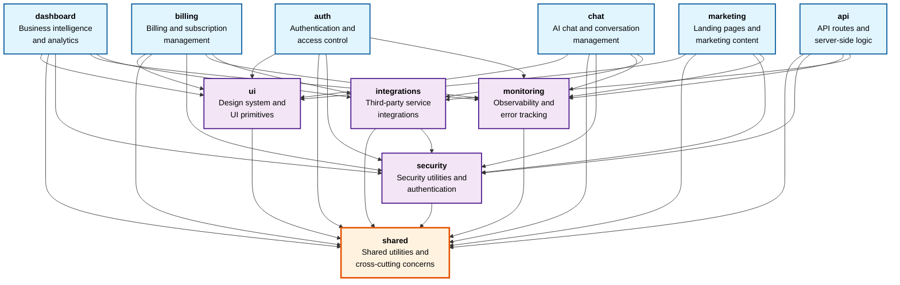

# Architecture Overview

This document provides a comprehensive overview of the Corso codebase architecture, design patterns, and architectural decisions.

## 🏗️ System Architecture

### Technology Stack

- **Framework**: Next.js 16.0.10 (App Router)
- **React**: 18.3.1
- **Authentication**: Clerk v6.36.2
- **Database**:
  - ClickHouse (analytics/data warehouse)
  - Supabase (relational data)
- **Language**: TypeScript 5.9.3 (strict mode)
- **Package Manager**: pnpm 10.17.1
- **Testing**: Vitest 3.2.4

### Core Principles

1. **Zero-Trust Security**: All routes require authentication and authorization
2. **Separation of Concerns**: Clear boundaries between UI, business logic, and data access
3. **Type Safety**: Strict TypeScript with comprehensive type coverage
4. **Runtime Boundaries**: Strict client/server separation with Edge compatibility
5. **Domain-Driven Design**: Organized by business domains with clear boundaries

## 📁 Project Structure

For detailed directory structure and route organization, see:
- [App Directory Structure](./app-directory-structure.md) - Complete Next.js App Router organization
- [Codebase Structure](../architecture/codebase-structure.md) - Full directory reference

**High-level organization:**
- `app/` - Next.js App Router (route groups, pages, API routes)
- `components/` - React components (atomic design system)
- `lib/` - Business logic, utilities, configurations
- `types/` - TypeScript type definitions
- Hooks are domain-colocated (e.g., `components/ui/hooks/`, `components/chat/hooks/`)
- `docs/` - Documentation
- `api/` - OpenAPI specifications

## 🎯 Design Patterns

### 1. Domain-Driven Architecture

The codebase follows domain-driven design principles with clear domain boundaries:

- **Domain Barrels**: Each domain (`auth`, `dashboard`, `integrations`, etc.) has a barrel export
- **No Cross-Domain Imports**: ESLint rules prevent direct cross-domain leaf imports
- **Facade Pattern**: Use domain barrels or promote to `@/lib/shared` for cross-domain needs

**Domain Dependency Graph:**



**Dependency Rules:**
- **Application domains** (dashboard, billing, chat, auth, marketing, api) can depend on foundation domains
- **Foundation domains** (ui, security, integrations, monitoring) can only depend on `shared`
- **Shared domain** has no dependencies (foundation layer)
- All dependencies are defined in `config/domain-map.ts` and validated by dependency-cruiser

**Example:**
```typescript
// ✅ CORRECT: Use Clerk auth() directly
import { auth } from '@clerk/nextjs/server';

// ❌ INCORRECT: Cross-domain leaf import
import { someUtil } from '@/lib/other-domain/internal-file';
```

### 2. Runtime Boundaries (Client/Server Separation)

Strict separation between client and server code:

- **Client-Safe Barrels**: `@/lib/api`, `@/lib/shared` (Edge-compatible)
- **Server-Only Barrels**: `@/lib/server`, `@/lib/auth/server` (Node.js only)
- **Runtime Exports**: All routes declare `export const runtime = 'edge' | 'nodejs'`

**Pattern:**
```typescript
// Client component
'use client';
import { http } from '@/lib/api'; // ✅ Edge-safe

// Server component/route
import { getEnv } from '@/lib/server/env'; // ✅ Node.js only
export const runtime = 'nodejs';
```

### 3. Data Access Layer

Clear separation between UI and data access:

- **Client Components**: Use React Query hooks (`useWarehouseQuery`) that call API routes
- **Server Components**: Can use direct database access via service layer
- **API Routes**: All database queries go through `/api/v1/*` endpoints
- **Domain Layer**: Business logic in `lib/<domain>/` (e.g., `lib/entities/`, `lib/integrations/`)

**Pattern:**
```typescript
// ✅ CORRECT: Client component uses hook → API route
'use client';
const { data } = useWarehouseQuery('SELECT * FROM projects');

// ✅ CORRECT: Server component uses service layer
import { fetchEntityData } from '@/lib/entities/actions';

// ❌ INCORRECT: Direct database import in component
import { getClickHouseClient } from '@/lib/integrations/clickhouse/client';
```

### 4. Atomic Design System

Component organization follows atomic design principles:

- **Atoms**: Basic UI primitives (`@/atoms`)
- **Molecules**: Composed components (`@/molecules`)
- **Organisms**: Complex sections (`@/organisms`)
- **Domain Modules**: Feature-complete sections (dashboard/, marketing/, etc.)

### 5. Next.js 16 App Router Patterns

- **Route Groups**: `(auth)`, `(marketing)`, `(protected)` for organization
- **Server Components by Default**: Components are server components unless marked `'use client'`
- **Streaming & Suspense**: Used for progressive page rendering
- **Route Handlers**: API routes in `app/api/` with proper runtime declarations
- **Metadata API**: SEO and metadata via `generateMetadata` functions

## 🔐 Security Architecture

### Authentication & Authorization

- **Clerk Integration**: All authentication via Clerk v6
- **Middleware**: `middleware.ts` handles auth checks and redirects
- **RBAC**: Role-based access control for API endpoints
- **Session Management**: Clerk session tokens with custom claims

### API Security

- **Versioned APIs**: All public APIs under `/api/v1/`
- **Internal APIs**: Privileged endpoints under `/api/internal/`
- **Rate Limiting**: Applied to all endpoints via `withRateLimitEdge` or `makeEdgeRoute`
- **Input Validation**: Zod schemas for all inputs
- **Error Handling**: Standardized error responses via `http.*` helpers

## 📊 Data Architecture

### Database Strategy

- **ClickHouse**: Analytics and data warehouse queries
- **Supabase**: Relational data and user management
- **Query Patterns**:
  - Client: React Query hooks → API routes → ClickHouse/Supabase
  - Server: Direct service layer access

### Caching Strategy

- **React Query**: Client-side caching with configurable `staleTime`
- **API Caching**: Optional cache headers for API responses
- **Static Generation**: Next.js ISR for marketing pages

## 🧩 Integration Patterns

### External Services

- **Clerk**: Authentication and user management
- **OpenAI**: AI chat functionality
- **Stripe**: Payment processing
- **Supabase**: Database and auth
- **ClickHouse**: Analytics data warehouse

All integrations follow the pattern:
- Client wrapper in `lib/integrations/{service}/client.ts`
- Server implementation in `lib/integrations/{service}/server.ts`
- Type definitions in `types/integrations/{service}/`

## 🎨 Styling Architecture

### Design System

- **Tailwind CSS**: Utility-first CSS framework
- **Design Tokens**: Centralized in `styles/tokens/`
- **Variants**: Type-safe component variants via `tailwind-variants`
- **Theme System**: Route-based theming with `data-route-theme` attributes

### Component Styling

- **Atomic Design**: Styles organized by component hierarchy
- **Token-Based**: No raw colors, use design tokens
- **Responsive**: Mobile-first breakpoint system

## 🧪 Testing Architecture

### Test Organization

- **Unit Tests**: Component and utility tests
- **Integration Tests**: API route and service tests
- **E2E Tests**: Full user flow tests (when applicable)
- **Test Location**: `tests/` directory mirroring source structure

### Testing Patterns

- **Vitest**: Test runner with React Testing Library
- **MSW**: API mocking for integration tests
- **Test Utilities**: Shared test helpers in `tests/support/`

## 📦 Build & Deployment

### Build Configuration

- **Next.js Build**: Optimized production builds
- **TypeScript**: Project references for incremental compilation
- **Bundle Analysis**: Optional bundle size analysis
- **Code Splitting**: Automatic via Next.js and dynamic imports

### Quality Gates

All code must pass:
1. TypeScript type checking (`pnpm typecheck`)
2. ESLint linting (`pnpm lint`)
3. Test suite (`pnpm test`)
4. Custom rule validation (`pnpm validate:cursor-rules`)

## 🔄 Development Workflow

### Local Development

1. Install dependencies: `pnpm install`
2. Verify tools: `pnpm run verify:ai-tools`
3. Setup branch: `pnpm run setup:branch`
4. Validate env: `pnpm validate:env`
5. Start dev server: `pnpm dev`

### Code Quality

- **Pre-commit Hooks**: Husky + lint-staged
- **Conventional Commits**: Enforced via commitlint
- **CI/CD**: Automated checks on all PRs

## 📚 Related Documentation

- [Domain-Driven Architecture](../architecture-design/domain-driven-architecture.md)
- [Runtime Boundaries](runtime-boundaries.md)
- [Import Patterns](../architecture/import-patterns.md)
- [Security Standards](../security/security-policy.md)
- [Component Design System](../../.cursor/rules/component-design-system.mdc)

## 🎯 Architectural Decisions

### Key Decisions

1. **Next.js App Router**: Chosen for modern React patterns and performance
2. **TypeScript Strict Mode**: Maximum type safety
3. **Domain-Driven Design**: Scalable organization for growing codebase
4. **Runtime Boundaries**: Clear client/server separation for Edge compatibility
5. **Atomic Design**: Consistent component organization

### Trade-offs

- **Server Components by Default**: Better performance, but requires careful client boundary management
- **Strict TypeScript**: More upfront work, but catches errors early
- **Domain Boundaries**: Prevents some convenient imports, but improves maintainability

## 🔮 Future Considerations

### Planned Improvements

- Enhanced monitoring and observability
- Advanced caching strategies
- Performance optimizations
- Expanded test coverage
- Accessibility improvements

### Scalability

The architecture is designed to scale:
- Clear domain boundaries prevent coupling
- Runtime boundaries enable Edge deployment
- Type safety reduces runtime errors
- Modular structure supports team growth

---

**Last Updated**: 2025-12-15  
**Maintained By**: Platform Team  
**Status**: Active
